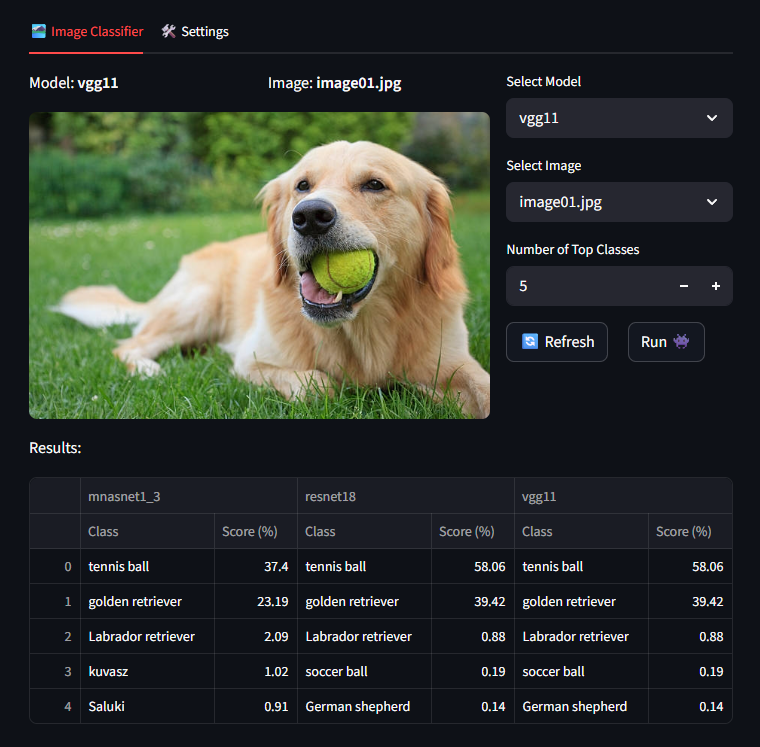
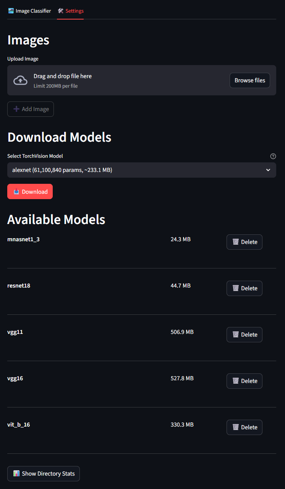

<a id="home"></a>
# Docker + FastAPI + Streamlit Image Classification

A minimal, containerized demo for exploring PyTorch image classification using a FastAPI backend and a Streamlit web interface. Both services launch instantly with a single Docker Compose command. The setup supports easy comparison of classification results and fast experimentation with neural networks on custom images. Shared volumes ensure seamless access to models and data, and users can browse, download, and save from dozens of available TorchVision models.

<a id="table-of-contents"></a>
## 🏡 Quick Links


<div style="column-count: 2; column-gap: 2rem;">

- [⭐ Features](#features)  
- [🚀 Getting Started](#getting-started)  
- [🏗️ Project Structure](#project-structure)
- [📦 API (Quick Reference)](#api-quick-reference)  
</div>

<a id="features"></a>
# ⭐ Features <span style="float: right;">[🏡](#home)</span>


- **Two-service stack:** FastAPI backend for model loading + inference; Streamlit frontend for model/image selection and prediction visualization.
- **Dockerized dev loop:** `docker-compose.yml` builds both services and mounts source directories for live code reloading.
- **Shared volumes:** `/models` and `/images` are mounted into both containers so the UI and API access the same assets.
- **Example model & assets:** Includes a sample `resnet18.pkl` and starter images under `images/` to get you going quickly.
- **FastAPI-powered backend:** Complete endpoints for model management, image classification, and TorchVision integration with automatic documentation and robust error handling.
- **Fast, persistent model loads:** After you call `/load_model`, the model remains resident in the FastAPI container and is immediately available for subsequent inference requests—no need to reload each time.
- **Compare models on the same image:** View per-class predictions from multiple models side‑by‑side in a table.
- **Download and Load any torchvision model**: Pull and use any available model from `torchvision` in the system for quick testing (deletion is also supported).
- **Add new images:** Upload images from your system to run through the model.

<a id="getting-started"></a>
# 🚀 Getting Started <span style="float: right;">[🏡](#home)</span>

## 1. Prerequisites
- Docker + Docker Compose installed.
- ~4GB free disk space (Torch base image can be large).

## 2. Clone & enter the project
```bash
git clone https://github.com/filipenovais/DockerFastapiStreamlitAPP.git
cd DockerFastapiStreamlitAPP
```

## 3. Build & run the stack
```bash
docker compose up --build
```
This launches:
- FastAPI at http://localhost:8000
- Streamlit UI at http://localhost:8501

## 4. Use the UI
In your browser:
1. Open the Streamlit app (http://localhost:8501).
2. Select a **model** (pulled from `models/`).
3. Select an **image** (from `images/`).
4. Click **Run Model** to send the image to FastAPI and view top-k class scores.





<a id="project-structure"></a> 
# 🏗️ Project Structure <span style="float: right;">[🏡](#home)</span>
```text
├── fastapi_service/
│   ├── Dockerfile
│   ├── app.py
│   ├── model_inference.py
│   ├── model_manager.py
│   └── utils.py
├── streamlit_service/
│   ├── Dockerfile
│   ├── app.py
│   ├── api_requests.py
│   └── utils.py
├── images/
│   ├── image01.jpg
│   ├── image02.png
│   ├── image03.jpg
│   ├── image04.jpg
│   └── image05.jpg
├── models/
│   └── resnet18.pkl
├── docker-compose.yml
├── README.MD
├── screenshot.png
├── screenshot1.png
├── screenshot2.png
└── .gitignore
```
<a id="api-quick-reference"></a>
# 📦 API (Quick Reference) <span style="float: right;">[🏡](#home)</span>

#### **GET** Load model  
`GET /load_model?model_path=<path>` ➤ loads model from specified path.

#### **POST** Infer model  
`POST /infer_model` (multipart form: `file=<image>`, `top_k=<int>`) ➤ returns top classes + scores.

#### **GET** TorchVision models  
`GET /torchvision_models` ➤ returns list of available TorchVision models.

#### **GET** Download model  
`GET /download_model?models_dir=<dir>&model_name=<name>` ➤ downloads specified TorchVision model to models directory.

---
