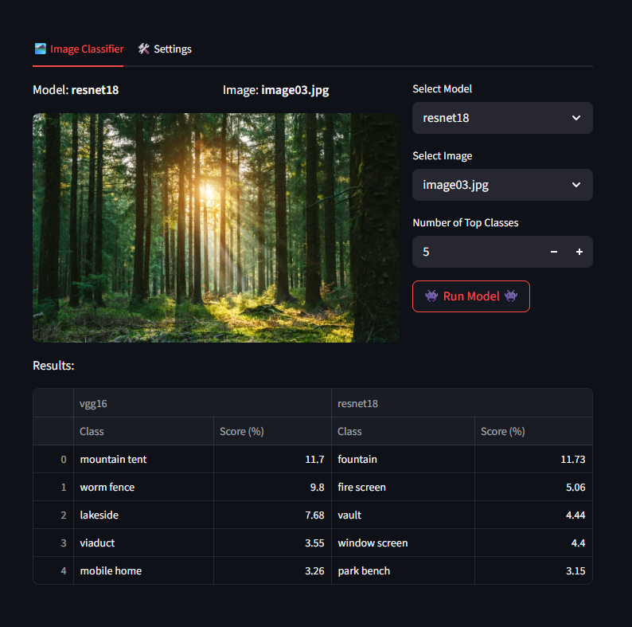

# Docker + FastAPI + Streamlit Image Classification

A **minimal, containerized demo** showing how to serve a PyTorch image classification model with a FastAPI backend and a Streamlit web UI frontend. Models and sample images are shared across services via mounted volumes, making it easy to experiment in development.


# ⭐ Key Features

- **Two-service stack:** FastAPI backend for model load + inference; Streamlit frontend for selecting models/images and visualizing predictions.
- **Dockerized dev loop:** `docker-compose.yml` builds both services and mounts source directories for live code reloading.
- **Shared volumes:** `/models` and `/images` mounted into both containers so the UI and API see the same assets.
- **Example model + assets:** Includes a sample `resnet18.pkl` and example images under `images/` to get you started quickly.
- **Simple REST API:** `/load_model?model_path=...` and `/infer_model` (image upload, `top_k`) endpoints.

# 🚀 Getting Started

## 1. Prerequisites
- Docker + Docker Compose installed.
- ~4GB free disk space (Torch base image can be large).

## 2. Clone & enter the project
```bash
git clone https://github.com/filipenovais/DockerFastapiStreamlitAPP.git
cd DockerFastapiStreamlitAPP
```

## 3. Build & run the stack
```bash
docker compose up --build
```
This launches:
- FastAPI at http://localhost:8000
- Streamlit UI at http://localhost:8501

## 4. Use the UI
In your browser:
1. Open the Streamlit app (http://localhost:8501).
2. Select a **model** (pulled from `models/`).
3. Select an **image** (from `images/`).
4. Click **Run Model** to send the image to FastAPI and view top-k class scores.




# 🏗️ Project Structure
```text
├── .gitignore
├── README.MD
├── docker-compose.yml
├── fastapi_service/
│   ├── Dockerfile
│   ├── app.py
│   ├── model_inference.py
│   ├── model_manager.py
│   └── utils.py
├── images/
│   ├── image01.jpg
│   ├── image02.png
│   ├── image03.jpg
│   └── image04.jpg
├── models/
│   └── resnet18.pkl
├── screenshot.png
├── streamlit_service/
│   ├── Dockerfile
│   └── app.py
```

# API (Quick Reference)

**Load model**  
`GET /load_model?model_path=<path-without-ext>` → loads `<path>.pkl` from `/models`.

**Infer model**  
`POST /infer_model` (multipart form: `file=<image>`, `top_k=<int>`) → returns top classes + scores.

---
